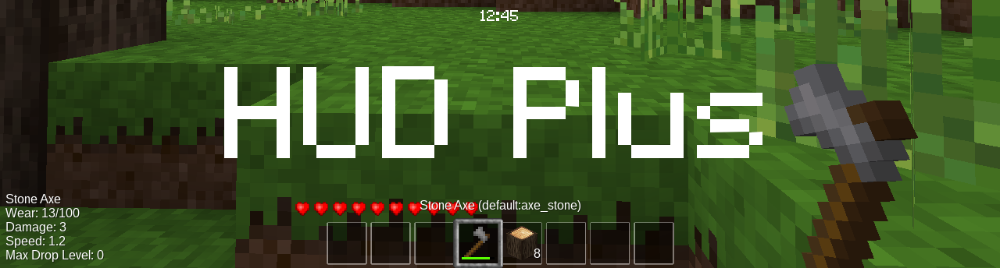

HUD Plus [hudplus]
====================
* Version 0.1, alpha
* Code: MIT (see LICENSE), Media: CC-BY-SA 3.0
* Dependencies: [hudlib](https://forum.minetest.net/viewtopic.php?f=9&t=16990)

__Note__: HUD Plus requires that you have `minetest-dev` with [this commit](https://github.com/minetest/minetest/commit/f2f9a923515386d787a245fac52f78e815b3a839) or later.

HUD Plus uses HUDLib to create a more intuitive set of HUDs for players. This mod is currently small, but it has the potential to become huge considering the simplicity and expandability of the HUDLib API. The mod will soon include hunger, armor, and improved health statbars. See below for more information on current and planned features. If you don't want any of the features offered by this mod, you can disable them by disabling the respective module. For example, to prevent HUD Plus from displaying information about the tool you are holding, simply add `tool_info = false` on a new line in modules.conf.

### Features
- Item description and itemstring is displayed when selected in hotbar
- Displays tool information in bottom-left when selected in hotbar
- Clock to display time

### Planned
- Replace default Health Statbar
- Hunger Statbar
- Armor Statbar

### Download
[Master](https://github.com/octacian/hudplus/archive/master.zip) (latest, stable) 
...or Browse the code on [GitHub](https://github.com/octacian/hudplus)

__IMPORTANT:__ HUD Plus depends on [hudlib](https://forum.minetest.net/viewtopic.php?f=9&t=16990), so don't forget to download and install that as well.

This is a rolling release (there are no specific versions), so it is save to simply download the latest master copy. Though it is recommended, you are not required to rename the resulting directory to `hudplus`.
